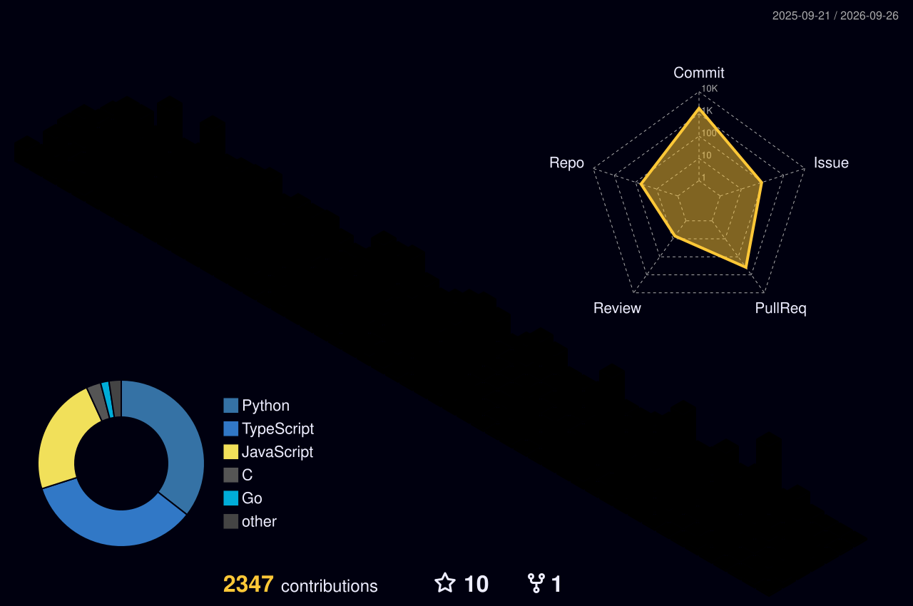
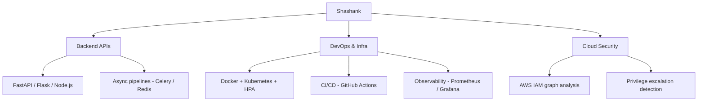

<div align="center">


</div>

<div align="center">


</div>

<p align="center">
  <a href="https://shashank-portfolio-snowy.vercel.app/"></a>
  <a href="https://www.linkedin.com/in/shashank-chakraborty/"></a>
  <a href="mailto:shashankchakraborty712005@gmail.com"></a>
</p>

---

<h3 align="center">🐍 something's eating my commit history</h3>

<div align="center">
<picture>
  <source media="(prefers-color-scheme: dark)" srcset="dist/github-contribution-grid-snake-dark.svg" />
  <source media="(prefers-color-scheme: light)" srcset="dist/github-contribution-grid-snake.svg" />
  
</picture>
</div>

<p align="center"><sub>⚙️ auto-generated nightly by GitHub Actions — see setup below</sub></p>

---

<h3 align="center">🧊 my contributions, but make it 3D</h3>

<div align="center">

</div>

---

### `$ kubectl get engineer shashank -o yaml`

```yaml
apiVersion: v1
kind: Engineer
metadata:
  name: shashank-chakraborty
  location: bengaluru-in
  status: fourth-year-student
spec:
  focus: [backend-engineering, devops-automation, cloud-security]
  currentlyBuilding: infrastructure-drift-detection-engine
  personality: >
    Will rebuild a working CI/CD pipeline for a 6-minute improvement.
    Reads incident postmortems for fun. Cannot leave a sequential
    pipeline alone — will parallelize it out of principle.
status:
  uptime: "since 2023"
  lastIncident: "shipped instead of sleeping"
  reliability: "measured, not assumed"
```

---

### 📡 skill radar

<div align="center">

</div>

---

### 🛰️ `$ terraform plan` — current infra



---

### 📟 `$ git log --oneline --graph --decorate` — highlight reel

```
* a1b2c3d (SystemCraft) parallelize CI/CD pipeline
|         → 10min sequential → under 4min, fixed artifact-integrity bug too
* 9f8e7d6 (SystemCraft) k6 load test @ 500 concurrent users
|         → p95 latency 3.33s → 861ms (-74%), throughput +161%
* 4c5d6e7 (Shadow Permission Analyzer) BFS/DFS on AWS IAM graph
|         → detects multi-hop privilege escalation chains in Neo4j
* 2b3c4d5 (DocuFlow) event-driven invoice pipeline
|         → async workers cut processing time by 40%
* 1a2b3c4 (Hackman) 24hr national hackathon, team ClarityAI
          → top 10, agentic decision-intelligence tool
```

---

### 📦 featured deploys

<details>
<summary><b>SystemCraft</b> — real-time system design simulator (<a href="https://www.system-craft.me/">live</a> · <a href="https://github.com/Shashank0701-byte/system-craft">repo</a>)</summary>
<br>

Built to answer one question: does my infra work under load, or does it just look like it does? Kubernetes HPA, a CI/CD pipeline I tore apart and rebuilt for speed, and a Gemini-powered evaluation engine with race-condition handling on concurrent AI calls.

**Stack:** Next.js · MongoDB · Kubernetes · GitHub Actions · Prometheus/Grafana · k6

</details>

<details>
<summary><b>Shadow Permission Analyzer</b> — AWS IAM privilege-escalation detector (<a href="https://github.com/Shashank0701-byte/Shadow-permission-analyser">repo</a>)</summary>
<br>

Models IAM identities as a graph instead of a flat policy list, because privilege escalation is a *path* problem, not a single-permission problem. BFS/DFS traversal finds multi-hop chains a manual audit would miss.

**Stack:** Python · Neo4j · FastAPI · boto3 · pytest

</details>

<details>
<summary><b>DocuFlow</b> — event-driven invoice pipeline (<a href="https://github.com/Shashank0701-byte/docuflow">repo</a>)</summary>
<br>

OCR parsing and data extraction split into independently scalable workers, because a single fat script is not a pipeline. 40% faster processing through async orchestration.

**Stack:** Python · Celery · Redis · PostgreSQL

</details>

<details>
<summary><b>🚧 DriftGuard</b> — infra drift detection engine (<i>planning</i>)</summary>
<br>

Compares live Docker/Kubernetes environments against Git-managed config and flags what quietly changed underneath you. Because "it worked when I deployed it" is not a monitoring strategy.

**Planned stack:** Python · FastAPI · Docker · Kubernetes · GitHub Actions

</details>

---

### 🧠 `$ leetcode` — solving problems, one bug at a time

<div align="center">

<a href="https://leetcode.com/u/shashankchakraborty712005/">


</a>

<br><br>

<a href="https://leetcode.com/u/shashankchakraborty712005/">


</a>

</div>

---

<div align="center">

```
$ echo "always be shipping" >> /etc/motd
```


</div>
